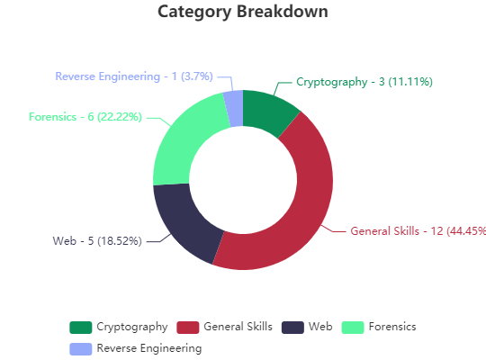
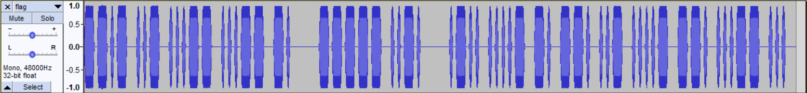
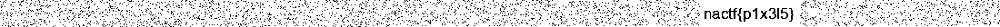

# Newark Academy CTF (NACTF)
October 30th - November 4th

Ranking: 172/968 with 2751 points (27 challenges solved).  




|Challenge|Category|Value|
|---------|------|--------|
|Caesar's Challenge|Cryptography|25|
|YAMS|Cryptography|100|
|Oligar's Tricky RSA|Cryptography|175|
|Gummies|Forensics|50|
|Meta-morphosis|Forensics|75|
|Secret Message|Forensics|100|
|Turnips|Forensics|100|
|Turnips 2|Forensics|150|
|Static|Forensics|250|
|Survey|General Skills|1|
|Join the Discord|General Skills|10|
|Intro to Flags|General Skills|10|
|Basics|General Skills|30|
|Hashbrowns|General Skills|50|
|Grep 0|General Skills|50|
|Dr. J's Vegetable Factory #1 🥕|General Skills|50|
|Numbers|General Skills|50|
|Arithmetic|General Skills|150|
|[Zip Madness](#zip-madness)|General Skills|175|
|[Grep 1](#grep-1)|General Skills|200|
|[World Trip](#world-trip)|General Skills|300|
|Generic Flag Checker® 1|Reverse Engineering|75|
|Inspect|Web|50|
|Missing Image|Challenge|Category|Value|
|Caesar's Challenge|Cryptography|25|
|YAMS|Cryptography|100|
|Oligar's Tricky RSA|Cryptography|175|
|Gummies|Forensics|50|
|Meta-morphosis|Forensics|75|
|[Secret Message](#secret-message)|Forensics|100|
|Turnips|Forensics|100|
|Turnips 2|Forensics|150|
|[Static](#static)|Forensics|250|
|Survey|General Skills|1|
|Join the Discord|General Skills|10|
|Intro to Flags|General Skills|10|
|Basics|General Skills|30|
|Hashbrowns|General Skills|50|
|Grep 0|General Skills|50|
|Dr. J's Vegetable Factory #1 🥕|General Skills|50|
|Numbers|General Skills|50|
|Arithmetic|General Skills|150|
|Zip Madness|General Skills|175|
|Grep 1|General Skills|200|
|World Trip|General Skills|300|
|Generic Flag Checker® 1|Reverse Engineering|75|
|Inspect|Web|50|
|Missing Image|Web|75|
|Forms|Web|125|
|Cookie Recipe|Web|150|
|Login|Web|175|

I'm still very much struggling on pwn/c rev. When I have more time, I'll focus more on learning those categories. Otherwise, I'm proud of the max on Forensics and General Skills (minus the vegetable algos), specifically Static and World Trip.


# General Skills
- *Basics*: Base64
- *Grep 0*: Use grep to search for 'nactf'
- *Numbers*: Shift each number down by one, convert decimal to ASCII.
- *Hashbrowns*: MD5 hash, can use [MD5 online](https://www.md5online.org/md5-decrypt.html)
- *Arithmetic*: Integer overflow.

## Zip Madness
> Evan is playing Among Us and just saw an imposter vent in front of him! Help him get to the emergency button by following the directions at each level.

Each zip folder holds two files, a left and right zip and a 'direction.txt' which tells you which file to open. We can write a short script to read the direction, append it to the number we're unzipping, and unzip the next file.

```
import os

for i in range(999,0,-1):
    direction = open('direction.txt').read()
    os.system("rm direction.txt")
    os.system("unzip " + str(i) + direction + ".zip")
    os.system("rm " + str(i+1) + "left.zip "+ str(i+1) + "right.zip")
```

Flag: `nactf{1_h0pe_y0u_d1dnt_d0_th4t_by_h4nd_87ce45b0}`


## Grep 1
> Elaine hid a REGULAR flag among more than 1,000,000 fake ones! The flag was an EXPRESSION of her love for nactf, so the first 10 characters after "nactf{" only have the characters 'n', 'a', 'c', and the last 14 characters only have the characters 'c', 't' and 'f'. There are 52 characters in total, including nactf{}.

Use Regex, they said. I'm OK, I said.

```
# Split flag.txt into lines
f = open('flag.txt').read().split()

# Check if each character of the given string is either n, a, or c
def is_fr_valid(s):
    al = 'nac'
    for i in s:
        if i not in al:
            return False
    return True

# Check if each character of the given string is either c, t, or f
def is_bk_valid(s):
    al = 'ctf'
    for i in s:
        if i not in al:
            return False
    return True

# For each line in the file, check if it's of length 52 and has a valid front and back
for i in f:
    if len(i) == 52 and is_fr_valid(i[6:16]) and is_bk_valid(i[-15:-1]):
        print(i)
    
```


## World Trip
> Will has been travelling the world! Here's a list of the coordinates of the places he's been to. There might be a secret message hidden in the first letter of all of the countries.

155 solves.

I used [this tool](https://github.com/che0/countries) to convert coordinates to countries. I then used [this website](https://countrycodeconverter.com/) to convert the country codes to country names.  

```
import countries
cc = countries.CountryChecker('TM_WORLD_BORDERS-0.3.shp')

f = open('enc.txt').read().splitlines()


for i in f:
    word = i.split(", ")
    try:
        cCode = cc.getCountry(countries.Point(float(word[0]), float(word[1]))).iso
        print(cCode)
    except:
        print(word)
```


Printed the first letters of each country name.
```
f = open('enc_converted.txt').read().splitlines()

for i in f:
    print(i[0:1], end="")
```    


Flag: `nactf{IHOPEYOUENJOYEDGOINGONTHATREALLYLONGGLOBALTOURIBOFAIQFUSETZOROPZNQTLENFLFSEMOGMHDBEEIZOIUOCGSLCDYMQYIRLBZKNHHFGBPDIVNBUQQYPDCQIAVDYTRFOCESEQUOUUMSKYJOVKVJGMRGNATNIRESHRKHCEDHHZYQRZVOGCHSBAYUBTRU}`


# Cryptography
- *Caesar's Challenge*: Caesar Cipher.
- *YAMS*: [Vigenere cipher](https://www.boxentriq.com/code-breaking/vigenere-cipher), key = yams.
- *Oligar's Tricky RSA*: Factor n using Alpertron to find p and q; use factors to calculate totient and d to get plaintext.


# Forensics

- *Gummies*: [Cool site](https://stylesuxx.github.io/steganography/)
- *Meta-morphosis*: Check metadata
- *Turnips*: I forgot oops
- *Turnips 2*: Open in hex editor, fix the [magic numbers](https://en.wikipedia.org/wiki/List_of_file_signatures) of the file header to make it into a PNG.

## Secret Message
> Monica loves inventing secret languages. So much so that she claims to be the only one to know the message in this recording. What does it say?
Open in audio viewer, convert longer bands and shorter bands into morse code.




## Static
> Juliet just airdropped me this really weird photo that looks like tv static. She said this would be easier than passing notes in class, but I can't understand what she's trying to say. I think Juliet said that the message text was black. Help!  
Hint: There seems to be some suspicious black lines in the image…

44 solves.  

We can use Pillow for image processing. If we convert every pixel that is not black to white, we see that there are some places where the black is more concentrated. If we play with the dimensions of the image using a pixel array (rather than just resizing), we can get the flag.

```
from PIL import Image

# Separate RGB arrays
im = Image.open(file('flag.png', 'rb'))
R, G, B = im.convert('RGB').split()
r = R.load()
g = G.load()
b = B.load()
w, h = im.size

# Convert non-black pixels to white
for i in range(w):
    for j in range(h):
        if(r[i, j] != 0 or g[i, j] != 0 or b[i, j] != 0):
            r[i, j] = 255 # Just change R channel

# Merge just the R channel as all channels
im = Image.merge('RGB', (R, R, R))

# Make a new pixel array, then make it into a new image with different dimensions
d = im.getdata()
im2 = Image.new('RGBA', (1100,30))
im2.putdata(d)
im2.save("solved.png")
```




# Web
- *Inspect*: Inspect element.
- *Missing Image*: Check the source code, there's a link to an image.
- *Forms*: At the very bottom, there's a verify() function that shows a plaintext username (`admin`) and password (`password123`). Ctrl-F for the form that calls the verify function, input to get flag.
- *Cookie Recipe*: Notice that when you login, a `user` cookie with the value `cookie_lover`, but it disappears when you refresh or logout. Add it back and get the flag.
- *Login*: SQL injection, `admin' OR 1=1 #` to the login field.