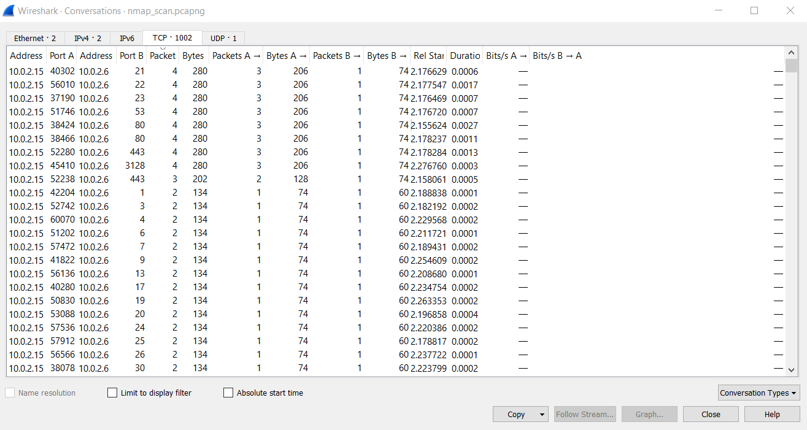
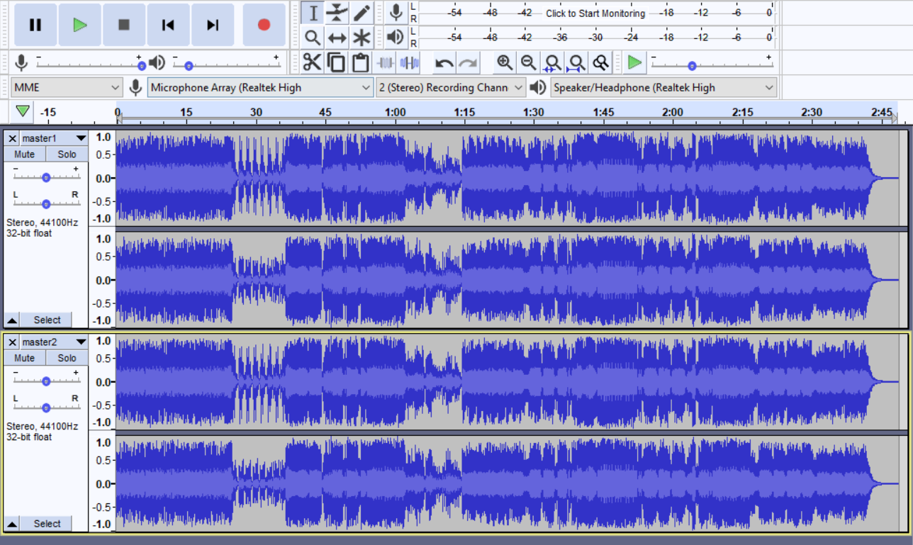
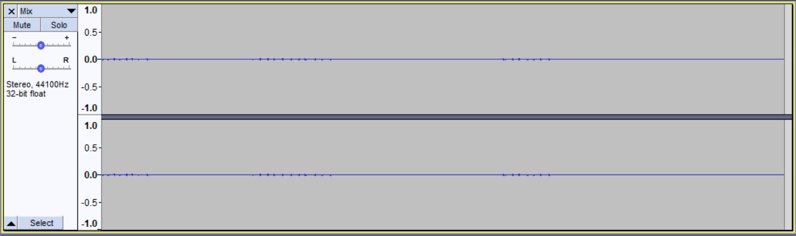

# MetaCTF
October 24-25 2020

Overall Ranking: 192/1586  
Student Ranking: 123/1017  
4025 points with 22 challenges solved.  

|Challenge|Type|Points|
|---------|------|--------|
|Baffling Buffer 0|Binary Exploitation|150|
|Crypto Stands For Cryptography|Cryptography|100|
|ROT 26|Cryptography|150|
|Welcome to the Obfuscation Games!|Cryptography|175|
|The Last Great ZIP File|Cryptography|200|
|Forensics 101|Forensics|100|
|Staging in 1...2...3|Forensics|150|
|Publish3r|Forensics|225|
|[Open Thermal Exhaust Port](#open-thermal-exhaust-port)|Forensics|275|
|You've Got a Friend In Me (and Discord)|Reconnaissance|50|
|Big Breaches|Reconnaissance|150|
|Not So Itsy Bitsy Spider|Reconnaissance|200|
|[Diving into the announcement](#diving-into-the-announcement)|Reconnaissance|225|
|Finding Mr. Casyn|Reconnaissance|275|
|[Complete Transparency](#complete-transparency)|Reconnaissance|325|
|Ring Ring|Reconnaissance|325|
|High Security Fan Page|Web Exploitation|125|
|Barry's Web Application|Web Exploitation|150|
|Everyone Loves a Good Cookie|Web Exploitation|175|
|Flag Format|Other|50|
|MetaCTF CyberGames Feedback|Other|200|
|[Watermarked](#watermarked)|Other|250|

I really enjoyed this 24-hour CTF! I almost lost my mind over the third part of the OSINT challenge Finding Mr. Casyn, but I learned something new. There were a lot of unique challenges in this comp, so here are a few I solved that I thought were interesting. 

## Open Thermal Exhaust Port
> Our TCP connect Nmap scan found some open ports it seems. We may only have a pcap of the traffic, but I’m sure that won’t be a problem! Can you tell us which ones they are? The flag will be the sum of the open ports. For example, if ports 25 and 110 were open, the answer would be MetaCTF{135}

This video was helpful: https://www.youtube.com/watch?v=Zi1aaEJg5YI

If we open the pcap file in WireShark, we can look at all the packets are sent. We need to figure out which ports are open, meaning that information was likely transferred. Let's look at the TCP Conversations.

All of the ports that have more than 2 packets transferred should be open.  
21 + 22 + 23 + 53 + 80 + 443 + 3128 = 3770

Flag: `3370`

## Diving into the announcement
> Vulnerabilities are patched in software all the time, and for the most serious ones, researchers work to build proof-of-concept (POC) exploits for them. As defenders, we need to continuously monitor when new public exploits drop, figure out how they work, and ensure we're protected against them. Recently, Microsoft announced CVE-2020-1472. Your task is to locate a public exploit for it and identify the vulnerable function that the POCs call. The flag will be the function's name.

Googling the CVE number, we find that the nickname is Zerologon and the [original research paper](https://www.secura.com/pathtoimg.php?id=2055).

The first function we find is the *ComputeNetLogonCredential*, but when we input it, MetaCTF asks us to find the function used to reset the computer's password. 

Searching for password in the doc, we find a diagram with a few functions. The last one, NetrServerPasswordSet2 is our flag.

Flag: `NetrServerPasswordSet2`

## Complete Transparency

> At ICMP Industries, we recently created a new subdomain off of our company website. Since our new super secret project is still in development, we chose a long subdomain so no one will know to visit it yet. We also went ahead and upgraded the site to use HTTPS to be more secure.  
The flag is the name of our secret subdomain. Note there are dashes between words instead of underscores since it's a domain name.  
Update: The right domain redirects to Cloudflare when visiting it - the company isn't hosting anything at the main website, but just off their secret subdomain  
Update 2: super_sketch_subdomain_not_so_sketch_flag is not the right subdomain, keep looking. That subdomain was used in an old problem we built.

I started this problem after it had updated twice, but googling `super_sketch_subdomain_not_so_sketch_flag` gave me the original domain of icmpindustries.com. I looked for and found a [subdomainfinder tool](https://www.nmmapper.com/sys/tools/subdomainfinder/), input the domain, and found the flag.

Flag: `a-transparent-but-not-invisible-flag`

## Watermarked
> Sonic watermarks are a security measure used by many different actors in the audio recording industry. Audio engineers sometimes mix them into unfinished tracks in case they are leaked outside of the studio, and developers of VST plugins often manipulate the generated sound to limit those using free trial or cracked versions of their software.  
You are an audio engineer working with famous post-lingual rapper Playball Carl, and you've been alerted to a leak that just surfaced on SoundCloud. Recover the watermark to find the identity of the leaker.

We're given a [Studio Version](watermarked/master1.flac) and a [Leaked Version](watermarked/master2.flac).

Waveforms have a property called wave interference. In this case, we want to look at destructive interference, where if a wave is out of phase with another identical wave and added, the amplitudes cancel out. 

We can use Audacity to do this. Import both of the waves into the same project in Audacity. We can invert one of them by selecting the entire waveform, then `Effect>Invert`. To combine the tracks and get the effect of destructive interference, we mix them together using `Tracks>Mix and Render`.
Here is the two tracks, with the lower inverted. 

Here is the combined wave! The characters of the flag are spoken.

Flag: `metactf{p4r7ing_7h3_w4v3z}`