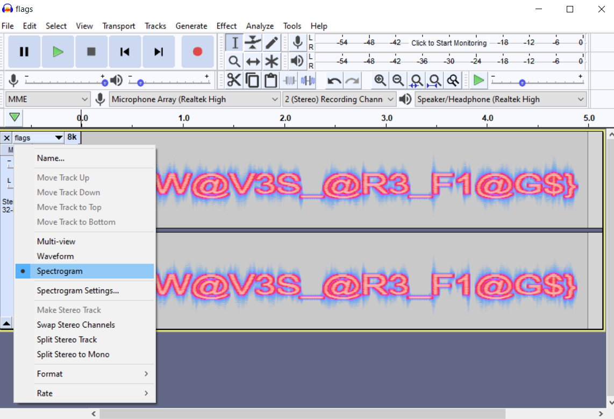

# [√-1 + 1] CTF server problems 
October 2020 Round

| Challenge               | Type | Points |
|-------------------------|------|--------|
| Welcome to Round 3! | Misc | 15 |
| Meta | Forensics | 100 |
| [Did you feel that wave?](didyoufeelthatwave/) | Misc | 175 |
| [Save Trees!](savetrees/) | Rev | 80 |
| [Colliders are the best Unity Components!](colliders/) | Rev | 60 |
| Whitened 2.0 | Misc | 100 |
| [AppleBot](#applebot) | Misc | 150 |
| [Blinking Lights](#blinking-lights) | Crypto | 50 |
| Optimization [NOT SOLVED] | Programming | 150 |
| Out of Office... | OSINT | 100 |
| [Is this art?](#is-this-art) | Forensics | 50 | 
| [Fuzzy](#fuzzy) | Forensics | 100 |
| [Just Add](justadd/) | Programming | 50 |

little behind on the daily challenges but it's fine


## Applebot
> I made a new Discord Bot! Its called @AppleBot and it gives you apples! It seems to have a lot of Apples it self though... Try to exploit it to get enough Apples to buy the flag in the shop! Or you could do it manually, but that would take a long time... Have Fun!

We first take a look at the commands we can use with the bot.
```
​No Category:
  Applebot Tells you how many Apples @AppleBot has
  balance  Gets your balance.
  buy      Buys stuff.
  clear    Clears all your Apples
  help     Shows this message
  shop     Displays the shop.
  transfer Transfers apples to someone else.
  work     Gives you apples.

Type $help command for more info on a command.
You can also type $help category for more info on a category.
```

If we check in the shop, there's just one item:
```
100000000000000000000000 Apples: flag
```

Working will give you 6 apples, which would take a very long time. The key command here is the `transfer` command. 
```
$transfer <person> <amount>

Transfers apples to someone else.
```

When we try to transfer apples to ourselves, our Discord tag doesn't actually ping us and the bot doesn't have a response. However, we find that we can transfer apples to the bot. If we test a negative number, we can transfer apples from the bot to ourselves. Hopefully the bot has an infinite amount!

```
$transfer @AppleBot -100000000000000000000000
You sent -100000000000000000000000 apples to AppleBot#xxxx

$balance
You have 100000000000000000000011 apples.

$buy flag
You bought the flag for 100000000000000000000 apples.

ictf{S0_M4NY_APPl3$_7OO_MUCH_W0RK_$0_W3_H4CK}
```

Flag: `ictf{S0_M4NY_APPl3$_7OO_MUCH_W0RK_$0_W3_H4CK}`


## Blinking Lights
> My friend sent me a series of flashing lights... I think he was trying to tell me something... I've copied them down for you, can you help me decode it?

Convert the emojis to binary. This can be done with a script or with an online text replacer ([for the lazy](http://www.unit-conversion.info/texttools/replace-text/)). Decode the binary.

Flag: `flag{C@N_UND3R$7AND?}`


## Is this art?
If we play with filters on [Forensically](https://29a.ch/photo-forensics/), we see some words in the middle of the image.


Flag: `ictf{!NV1$IBL3_BU7_N07_IM@G1N@RY}`

## Fuzzy
> My friend was rocking out to this music. It didn't seem like real music... He told me that the music was "super special." Can you help me figure it out?

If we listen to the file, do `strings`, and check the metadata, we don't find anything particularly interesting. Open the given .wav file in Audacity and change the view type to Spectrogram to get the flag.



Flag: `ictf{W@V3S_@R3_F1@G$}`