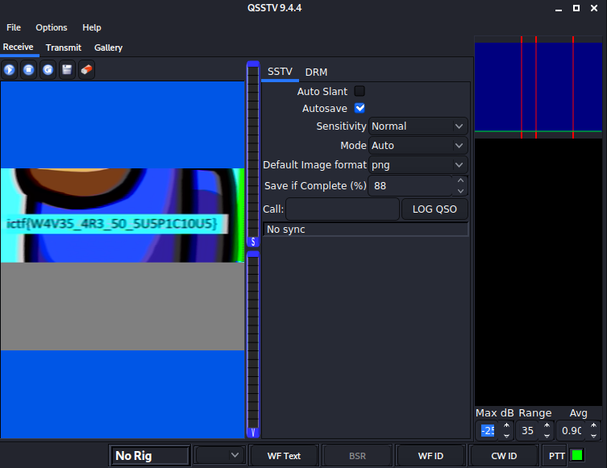

## Did you feel that wave?
> One of my friends sent me this file. However, I am still a newbie and I need your help to get access to its contents. Can you help me?
Hint 1: reverse
Hint 2: No hints for that challenge. Unless someone finds some in ISS transmissions...


The file attached is called challenge.enc. Opening the file in a hex editor, we see this near the top of the file:
```
vaw.egnellahc
```

Along with the hint to reverse, we try to literally reverse the bytes in the file.
```
f1 = open("output.txt", "wb")

with open("challenge.enc", "rb") as f2:
	data = f2.read()

data_1 = data[::-1]

f1.write(data_1)
f1.close()
```

Then, we check the file type:
```console
$ file output.txt
output.txt: RAR archive data, v5
```

We change the extension to `.rar` and use unrar to unpack it, which gives us `challenge.wav`. Nice! So the other hint is ISS transmissions. This is similar to a PicoCTF challenge, and references SSTV audio files, which were used to send images back from the moon landing and the ISS. [This tutorial](https://ourcodeworld.com/articles/read/956/how-to-convert-decode-a-slow-scan-television-transmissions-sstv-audio-file-to-images-using-qsstv-in-ubuntu-18-04) is pretty helpful in setting up an application called QSSTV, which can decode them for us.
```console
$ qsstv
$ paplay -d virtual-cable challenge.wav
```

here's the decoded transmission:


Flag: `ictf{W4V35_4R3_50_5U5P1C10U5}`